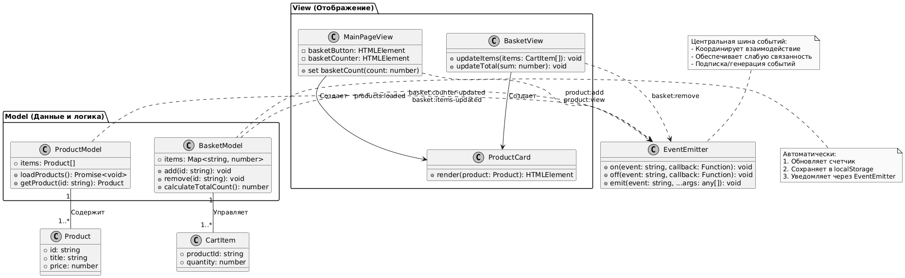
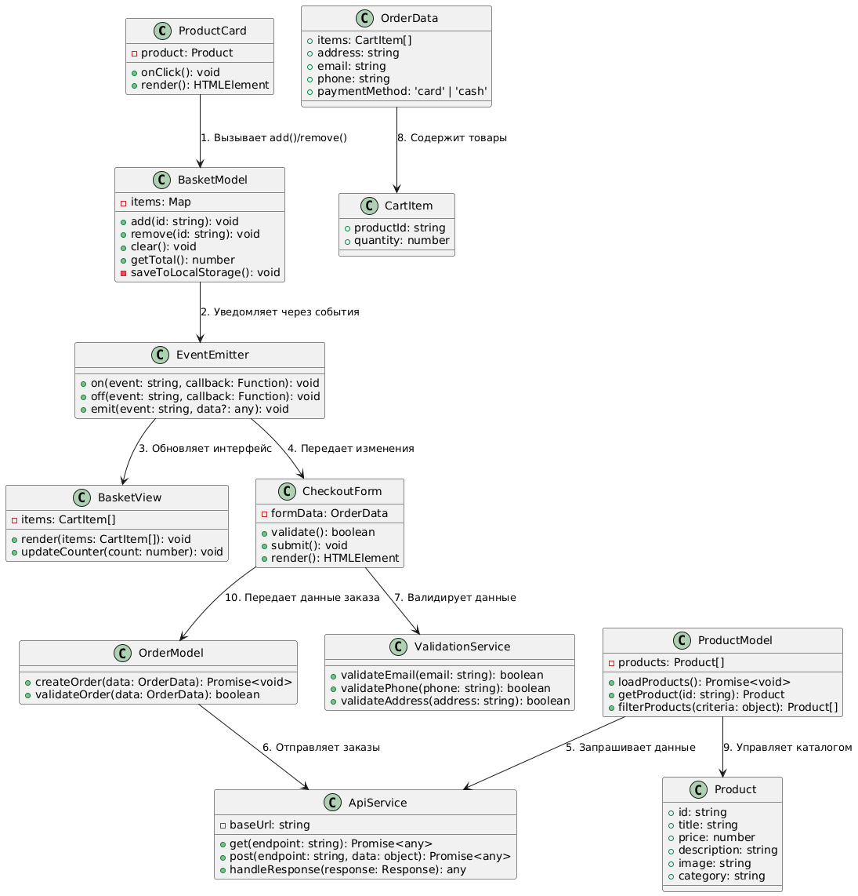

# Проектная работа "Веб-ларек"

## Оглавление
1. Обзор архитектуры
2. Технологический стек
3. Структура проекта
4. Важные файлы
4. API документация
5. Компоненты системы
6. Архитектуры проекта
7. Типы данных
8. UML-диаграмма
9. Процессы в приложении
10. Запуск и сборка

## Обзор архитектуры
Проект реализован с использованием паттерна MVP (Model-View-Presenter). Архитектура обеспечивает четкое разделение ответственности между компонентами:
1. Модели (Model) - работа с данными и бизнес-логикой
2. Представления (View) - отображение пользовательского интерфейса
3. Презентер (EventEmitter) - координация взаимодействия между слоями

## Технологический стек:
**Категория**
1. Языки (TypeScript, HTML)
2. Cтилизация (SCSS)
3. Сборка (Webpack)

## Структура проекта:
- src/ — исходные файлы проекта
- src/components/ — папка с JS компонентами
- src/components/base/ — папка с базовым кодом
- src/docs - схемы для документация проекта
- src/images - графические ресурсы
- src/pages - страницы приложения
- src/public - статические ресурсы
- src/scss - стили проекта
- src/types - типы TypeScript
- src/utils - вспомогательные утилиты
- src/vendor -  сторонние библиотеки

## Важные файлы:
- src/pages/index.html — HTML-файл главной страницы
- src/types/index.ts — файл с типами
- src/index.ts — точка входа приложения
- src/scss/styles.scss — корневой файл стилей
- src/utils/constants.ts — файл с константами
- src/utils/utils.ts — файл с утилитами

## API документация

### EventEmitter

**Назначение:** Центральная шина событий для связи между компонентами

**Функции:**
* Подписка/отписка на события (on, off)
* Генерация событий (emit)
* Управление списком подписчиков
```
class EventEmitter {
  on(event: string, callback: Function): void;
  off(event: string, callback: Function): void;
  emit(event: string, ...args: any[]): void;
}
```

### ProductModel

**Назначение:** Управление данными о товарах

**Функции:**
* Загрузка каталога товаров (loadProducts)
* Поиск товара по ID (getProduct)
* Фильтрация товаров (filterProducts)

```
class ProductModel {
  loadProducts(): Promise<void>;
  getProduct(id: string): Product | undefined;
}
```

### BasketModel

**Назначение:** Управление корзиной покупок

**Функции:**
* Добавление/удаление товаров (add, remove)
* Расчет общей суммы (getTotal)
* Очистка корзины (clear)
* Автосохранение состояния в localStorage

```
class BasketModel {
  add(productId: string): void;
  getTotal(): number;
}
```
## Компоненты системы

### ProductCard
**Назначение:** Отображение карточки товара

**Функции:**
* Показ основной информации о товаре
* Обработка кликов (добавление в корзину)
* Взаимодействие с BasketModel

**Связи:**
* Получает данные из ProductModel
* Вызывает методы BasketModel при действиях пользователя

### BasketView
**Назначение:** Отображение содержимого корзины

**Функции:**
* Рендер списка товаров
* Отображение общей суммы
* Обновление счетчика товаров

**Связи:**
* Подписывается на события BasketModel через EventEmitter
* Отображает данные из BasketModel

## Архитектура проекта

### Основные части системы:

1. Модели (Model) - работа с данными и бизнес-логикой

* ProductModel - товары и каталог
* BasketModel - корзина покупок
* OrderModel - оформление заказов

2. Представления (View) - пользовательский интерфейс

* ProductCard - карточка товара
* BasketView - отображение корзины
* CheckoutForm - форма оформления заказа

3. Презентер (EventEmitter) - координация взаимодействия

* Передача событий между компонентами
* Управление потоком данных



### Взаимодействие компонентов:

* Пользовательские действия обрабатываются View
* View вызывает методы Model или генерирует события
* Model обновляет данные и уведомляет через EventEmitter
* View реагирует на изменения и обновляет интерфейс

## Типы данных
### Основные интерфейсы:
```
export interface Product {
    id: string;
    title: string;
    price: number;
    description: string;
    image: string;
    category: string;
}

export interface CartItem {
    productId: string;
    quantity: number;
}

export interface OrderData {
    items: CartItem[];
    address: string;
    email: string;
    phone: string;
    paymentMethod: 'card' | 'cash';
}
```
### Интерфейсы моделей:
```
export interface IProductModel {
    items: Product[];
    loadProducts(): Promise<void>;
    getProduct(id: string): Product | undefined;
    filterProducts(criteria: Record<string, unknown>): Product[];
}

export interface IBasketModel {
    items: Map<string, number>;
    add(id: string): void;
    remove(id: string): void;
    clear(): void;
    getTotal(): number;
}

export interface IOrderModel {
    createOrder(data: OrderData): Promise<void>;
    validateOrder(data: OrderData): boolean;
}
```
### Интерфейсы представлений:
```
export interface IView {
    render(data?: object): HTMLElement;
}

export interface IProductCard extends IView {
    product: Product;
    onClick(): void;
}

export interface IBasketView extends IView {
    items: CartItem[];
    updateCounter(count: number): void;
}

export interface ICheckoutForm extends IView {
    formData: OrderData;
    onSubmit(): void;
}
```
## UML-диаграмма
### Ключевые сценарии:

#### Добавление товара в корзину:
1. Пользователь кликает кнопку в ProductCard
2. Генерация события `product:add`
3. BasketModel обновляет состояние
4. Рассылка события `basket:updated`
5. BasketView и Header обновляют интерфейс

#### Оформление заказа:
1. Заполнение CheckoutForm
2. Валидация через OrderModel
3. Отправка данных на сервер
4. Очистка корзины при успехе



### Блоки классов сгруппированы по категориям:
* Системные (EventEmitter)
* Модели (ProductModel, BasketModel, OrderModel)
* Компоненты (ProductCard, BasketView, CheckoutForm)
* Сервисы (ApiService, ValidationService)
* Типы данных (Product, CartItem, OrderData)

## Процессы в приложении
**1. Просмотр каталога:**
* ProductModel загружает данные
* ProductCard отображает товары
* При клике генерируется событие добавления в корзину

**2. Работа с корзиной:**
* BasketModel получает события
* Обновляет состояние корзины
* Через EventEmitter уведомляет BasketView об изменениях

**3. Оформление заказа:**
* CheckoutForm собирает данные пользователя
* OrderModel валидирует и отправляет данные
* При успехе очищает корзину и показывает подтверждение


## Установка и запуск
Для установки и запуска проекта необходимо выполнить команды

```
npm install
npm run start
```

или

```
yarn
yarn start
```
## Сборка

```
npm run build
```

или

```
yarn build
```

